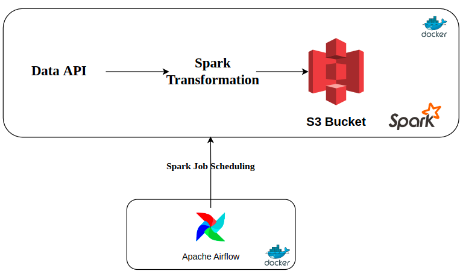
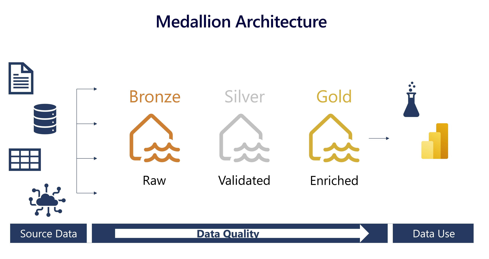
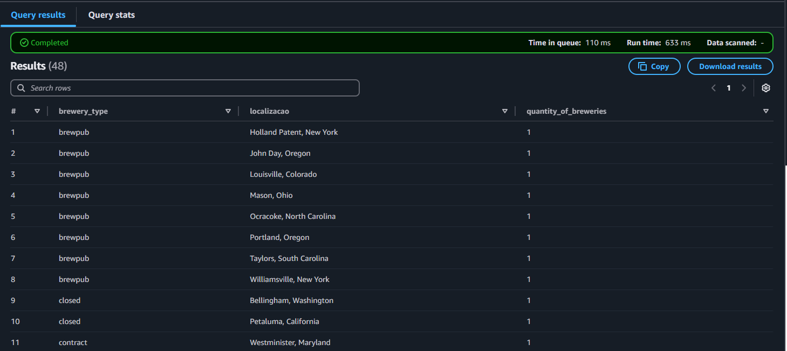

# Airflow-docker-Brewery_ETL
ETL using Airflow-docker-spark with a medallion architecture in S3
Autor : Pcosta


  
image by :Isaac Omolayo


# Open Brewery DB ETL Pipeline

This project implements an ETL (Extract, Transform, Load) pipeline for the Open Brewery DB API data, following the medallion architecture pattern with Bronze, Silver, and Gold layers. The pipeline is orchestrated using Apache Airflow and processes brewery data through different transformation stages.

## Architecture Overview



image by :datasarva (https://www.datasarva.com/lakehouse_medallion_architecture/)


- **Bronze Layer**: Raw data from the Open Brewery DB API
- **Silver Layer**: Cleaned and transformed data, partitioned by location
- **Gold Layer**: Aggregated business metrics (brewery counts by type and location)

## Prerequisites

- Docker and Docker Compose
- AWS Account with S3 access
- Python 3.9+
- Git

## Quick Start

### 1. Clone the Repository
    
```bash
git clone https://github.com/PedroMonk/Airflow-docker-Brewery_ETL.git
```

2. Configure AWS Credentials
Create a .env file in the project root with your AWS credentials:

```
AWS_ACCESS_KEY_ID=your_access_key
AWS_SECRET_ACCESS_KEY=your_secret_key
AWS_DEFAULT_REGION=your_region
S3_BUCKET=your-bucket-name
S3_BRONZE_PATH=bronze
S3_SILVER_PATH=silver
S3_GOLD_PATH=gold
```
3. Build and Start the Container
```bash
docker-compose up --build -d
```

5. Access Airflow UI

Navigate to http://localhost:8080 in your browser

```
Default credentials:

Username: airflow
Password: airflow
```


5. Run the Pipeline

In the Airflow UI, locate the brewery_ETL DAG
Click the "Play" button to trigger the DAG
Monitor the execution in the Tree or Graph view

```
Project Structure
Copyproject/
├── dags/
│   └── openbrewery_dag.py
├── scripts/
│   ├── load_bronze_module.py
│   ├── transform_silver.py
│   └── transform_gold.py
├── docker-compose.yaml
├── Dockerfile
├── requirements.txt
```

Pipeline Tasks

Extract Brewery Data: Fetches data from Open Brewery DB API
Load Bronze: Stores raw data in Parquet format
Transform Silver: Cleanses data and partitions by location
Transform Gold: Aggregates metrics by brewery type and location

Data Layers

Bronze Layer
  Raw data from API
  Parquet format
  Date partitioned

Silver Layer
  Cleaned data
  Type conversions
  Null handling
  Location partitioning

Gold Layer
  Aggregated metrics
  Business-level views
  Brewery type and location partitioning

Query Example ( first page )
To query the aggregated data in the Gold layer using AWS Athena:
```
sqlCopySELECT 
    brewery_type,
    localizacao,
    quantity_of_breweries
FROM 
    brewery_gold
WHERE 
    date = "SELECT_ONE_DATE"
ORDER BY
    brewery_type,
    localizacao;
```

image by : Autor


Monitoring

  Access task logs through Airflow UI[X]
  Monitor S3 data through AWS Console
  Check data quality in Athena

Troubleshooting
  Common issues and solutions:
  
  AWS Connectivity Issues
  
  Verify AWS credentials in .env
  Check S3 bucket permissions


Docker Issues

  Ensure Docker is running
  Check container logs: docker-compose logs -f
